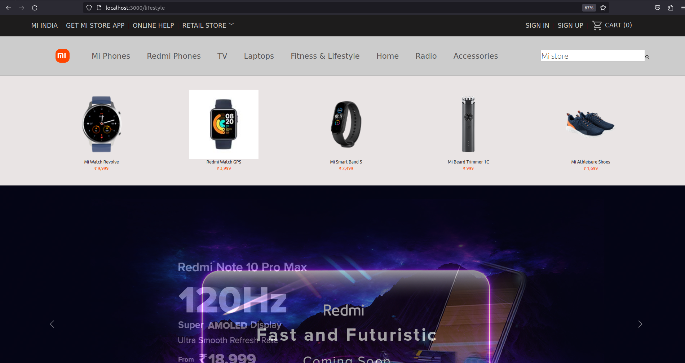
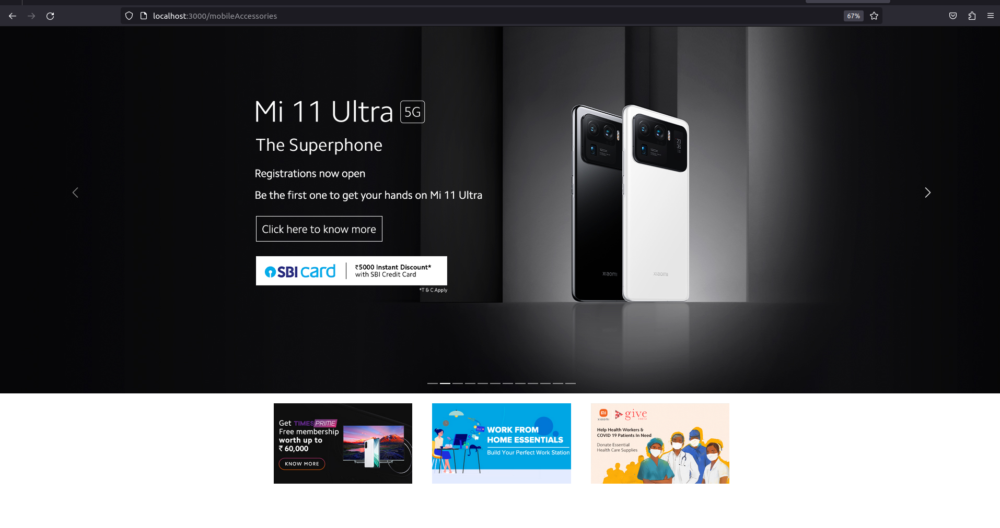

Xiaomi Store Clone

This project is a clone of the popular MI Store built using React, JavaScript, HTML, and CSS. The MI Store Clone aims to recreate the user interface and functionality of the original MI Store, providing users with a similar shopping experience.
Features

    Product Catalog: Browse through a wide range of products, including smartphones, accessories, and gadgets, just like the original MI Store.
    Product Details: Get detailed information about each product, such as specifications, features, and pricing.
    Search Functionality: Quickly find desired products by using the search bar.
    User Authentication: Register an account, log in, and manage your personal information.
    Shopping Cart: Add products to your cart, manage quantities, and proceed to checkout.
    Order Placement: Place orders securely and receive order confirmation.
    Payment Integration: Integrate popular payment gateways to facilitate secure and convenient transactions.
    Responsive Design: Enjoy a seamless shopping experience across different devices, thanks to the responsive design.

Technologies Used

    React: A popular JavaScript library for building user interfaces.
    JavaScript: The programming language used for the application's logic.
    HTML: The markup language used for structuring the webpages.
    CSS: The styling language used for visually enhancing the application.

Installation

    Clone the repository: git clone https://github.com/your-username/mi-store-clone.git
    Navigate to the project directory: cd mi-store-clone
    Install the dependencies: npm install
    Start the development server: npm start
    Open your browser and visit http://localhost:3000 to view the MI Store Clone.

Enjoy shopping with the MI Store Clone! If you have any questions or need assistance, feel free to reach out.

# Getting Started with Create React App

This project was bootstrapped with [Create React App](https://github.com/facebook/create-react-app).

## Available Scripts

In the project directory, you can run:

### `npm start`

Runs the app in the development mode.\
Open [http://localhost:3000](http://localhost:3000) to view it in your browser.

The page will reload when you make changes.\
You may also see any lint errors in the console.

T

